Integration of jquery.dynatree into OpenERP web
===============================================

This addon defines a new search field based on `jquery.dynatree
<http://wwwendt.de/tech/dynatree/index.html>`_ for arborescent
structures such as product and partner categories.

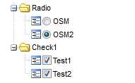

This project is at an early stage, feel free to contribute, and keep
posted ! See the included ``TODO.txt`` to see what's in the pipe.

Widget: ``m2o_dynatree``
------------------------

It is a many2one widget for arborescent model. the application is easy:

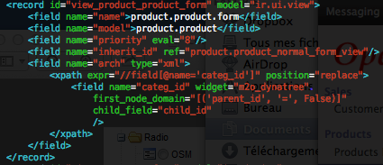

    In not editable, the widget m2o_dynatree, like classic many2one is a link 
    to model form view

The setting options are:

* domain: to filter all the line
* first_node_domain: Only to apply a filter on the first node, not use after
* child_field: like tree view, we need to know the child field of the model,
  by default it is ``child_ids``

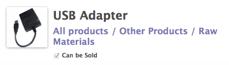

    In not editable node, the widget m2o_dynatree, like classic many2one is a 
    link to model form view

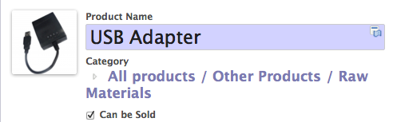

    In editable mode, the tree cursor is shown.

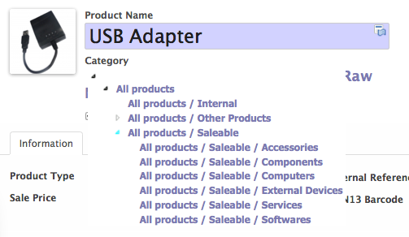

    Click on the cursor to open tree

.. figure:: images/m2o_dynatree4.png
    :align: center

    When you select a node, the tree is closed and the new value are selected.

View: ``tree_dynatree``
-----------------------

Like the view_mode tree in view type tree, the view tree_dynatree replace the
simple selector by dynatrees.

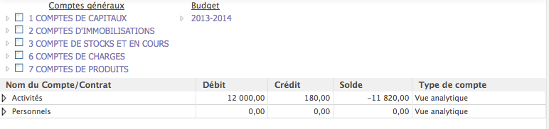

    The analytic plan chart has not a selector on a analytic account but a 
    dynatree on a general account and a dynatree on a budget

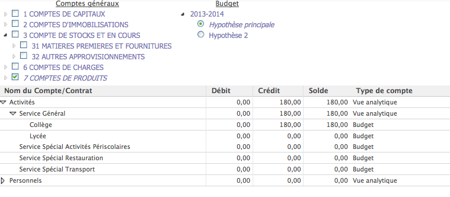

    The compute of the line depend of the dynatree's selected nodes

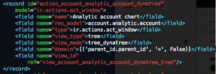

    The setting of the ir.actions.act_window is the same, just use 
    tree_dynatree

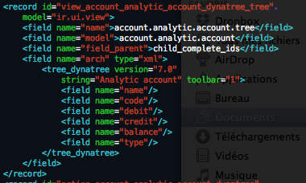

    The setting of the view is classic, Don't forgive the version="7.0"

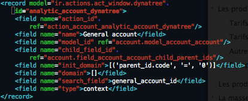

    The model of dynatree setting is ``ir.actions.act_window.dynatree``

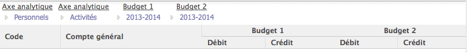

    Here it is the general account with analytic accont in dynatree

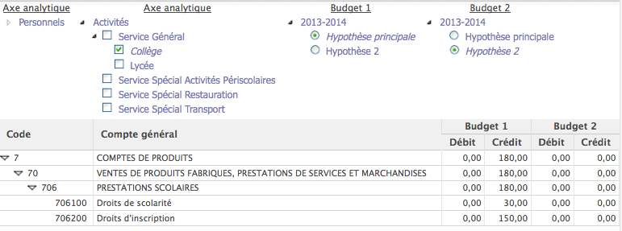

    Like list_multiheader, we use group node for multi header

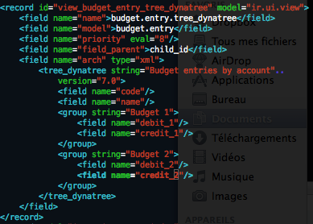

    The tree_dynatree is multiheader

The dynatree setting can also be added by OpenERP client

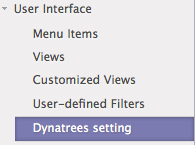

    A new menu are added

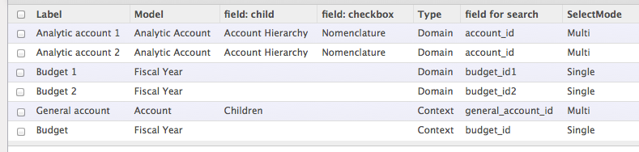

    Tree view

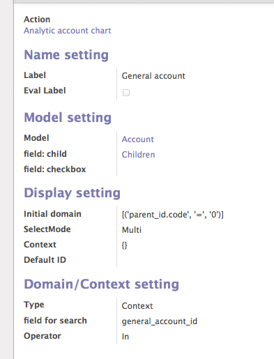

    Form view, 
    
.. warning:: The form view must be improve but all the concept exist
    

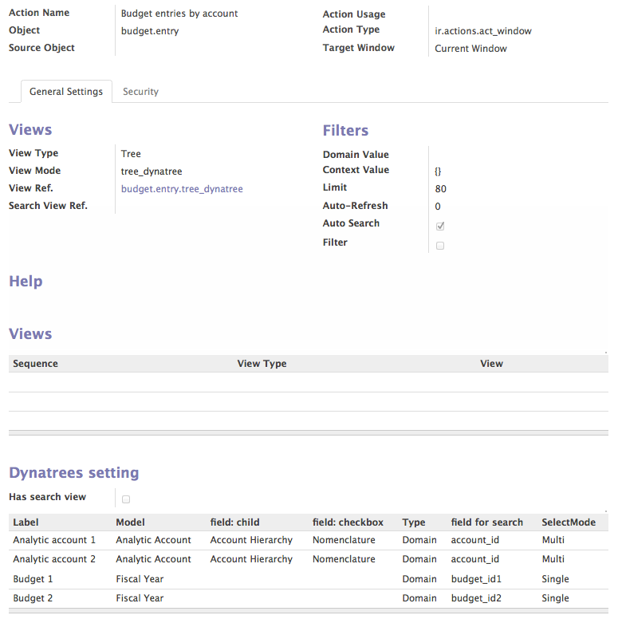

    A one2many to dynatrees are added on ``ir.actions.act_window`` model.

.. warning:: The capability to add ``search`` view but not tested

A hook method can be added on the model to make a specif action. For exemple 
the budget ``analytic.budget`` is linked on a period

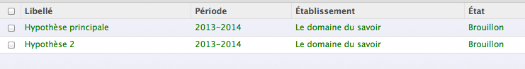

    The period is a many2one to ``account.fiscalyear``

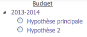

    The first node are the périod and the second the budget, period and buget 
    are not arborescent

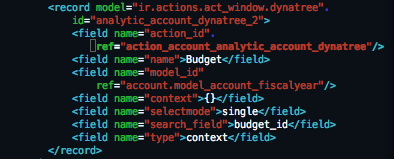

    The setting of the dynatree are the same then genral account dynatree

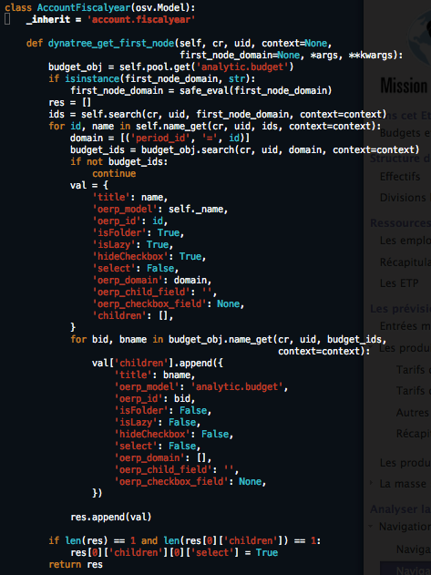

    We use a hook method to return all the node, without leazy mode.

The existing hook method are:

* tree_dyntaree_get_context: to define a specific context in function of 
  dynatree
* tree_dyntaree_get_domain: to define a specific domain in function od dynatree
* tree_dynatree_get_rows: to return the model line of the actions, it is a 
  read by default
